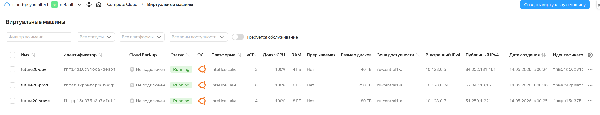

# Terraform: модуль ВМ Yandex Compute

Переиспользуемый модуль **`modules/vm`** и три корневых окружения **`envs/dev`**, **`envs/stage`**, **`envs/prod`** с разными **`*.tfvars`**. Провайдер — **`yandex-cloud/yandex`**.

```
Task1Advanced/
├── modules/vm/          # main.tf, variables.tf, outputs.tf, versions.tf
├── envs/{dev,stage,prod}/
│   ├── main.tf
│   ├── variables.tf
│   ├── outputs.tf
│   ├── versions.tf
│   ├── *.tfvars
│   └── *.full.tfvars.example
├── scripts/             # verify, apply/destroy по средам (только это задание)
└── img/
    └── screenshot.png   # пример: три ВМ после apply
```



## Модуль `modules/vm`

Создаётся ВМ с загрузочным диском, отдельным диском **`yandex_compute_disk`**, подключением через **`secondary_disk`**, интерфейсом в переданной подсети, SSH через **`metadata.ssh-keys`**. Имена окружений в модуль не зашиваются.

### Входные параметры

| Имя | Тип | Описание |
|-----|-----|----------|
| `vm_name` | string | Имя ВМ и префикс имени дополнительного диска |
| `zone` | string | Зона ВМ и диска |
| `cores` | number | vCPU |
| `memory` | number | RAM, ГБ |
| `subnet_id` | string | Подсеть |
| `ssh_public_key` | string | SSH-ключ для metadata; публичная часть ключа |
| `ssh_user` | string | Учётная запись для ssh-keys (по умолчанию `ubuntu`) |
| `attach_disk_size` | number | Размер дополнительного диска, ГБ |
| `attach_disk_type` | string | Тип диска (`network-hdd`, `network-ssd`, …) |
| `boot_disk_size` | number | Размер загрузочного диска, ГБ |
| `image_family` | string | Семейство образа |
| `enable_nat` | bool | Публичный IPv4 |
| `labels` | map(string) | Метки |
| `platform_id` | string | Платформа CPU |

### Выходы

`instance_id`, `instance_name`, `fqdn`, `internal_ip`, `external_ip`, `attach_disk_id`, `boot_disk_id`. В каждом **`envs/*/`** основные значения дублируются в **`outputs.tf`**.

### Окружения и `*.tfvars`

| Каталог | Файл | vCPU | RAM, ГБ | Доп. диск (ГБ / тип) | Загрузочный диск, ГБ | Имя ВМ |
|---------|------|------|---------|----------------------|----------------------|--------|
| `envs/dev` | `dev.tfvars` | 2 | 4 | 20 / `network-hdd` | 20 | `future20-dev` |
| `envs/stage` | `stage.tfvars` | 4 | 8 | 50 / `network-hdd` | 30 | `future20-stage` |
| `envs/prod` | `prod.tfvars` | 8 | 16 | 200 / `network-ssd` | 50 | `future20-prod` |

Файлы `*.tfvars` содержат различающиеся параметры окружений. Для запуска без `scripts/terraform_env.sh` рядом лежат полные примеры `*.full.tfvars.example`: скопируйте нужный файл в `*.full.tfvars`, заполните `cloud_id`, `folder_id`, `zone`, `subnet_id`, `ssh_public_key` и используйте его как единственный `-var-file`.

---

## Запуск

Все пути ниже — из **корня репозитория** (каталог, где рядом лежат **`Task1Advanced/`** и общая папка **`scripts/`**).

Скрипты **только этого задания** — в **`Task1Advanced/scripts/`**. Общие для нескольких заданий (**`terraform_env.sh`**, **`auth_cloud.sh`**, **`terraformrc.yandex.example`**) — в **`scripts/`** в корне репозитория.

### Переменные и доступ к API

Корень Terraform ожидает **`TF_VAR_cloud_id`**, **`TF_VAR_folder_id`**, **`TF_VAR_zone`**, **`TF_VAR_subnet_id`**, **`TF_VAR_ssh_public_key`** и **`YC_TOKEN`** для провайдера.

- **`source scripts/terraform_env.sh`** — подставляет недостающие **`TF_VAR_*`** из **`yc config`**, подсети по имени **`default-<зона>`** или первой подсети в зоне, ключ из **`TF_SSH_PUBKEY_FILE`** или **`~/.ssh/id_ed25519.pub`** / **`id_rsa.pub`**. Нужны **`yc`** и **`python3`**.
- **`source scripts/auth_cloud.sh`** при заданном **`YC_SERVICE_ACCOUNT_ID`** — выставляет **`YC_TOKEN`** (или задайте **`YC_TOKEN`** вручную).

### Ручной `terraform` по одной среде

Вариант с автоматическим заполнением облачных параметров из `yc config`:

```bash
source scripts/terraform_env.sh
source scripts/auth_cloud.sh   # если нет YC_TOKEN
cd Task1Advanced/envs/dev
terraform init
terraform plan  -var-file=dev.tfvars
terraform apply -var-file=dev.tfvars
```

Для **stage** / **prod** замените каталог и файл на **`stage.tfvars`**, **`prod.tfvars`**.

Вариант с одним полным var-file:

```bash
cd Task1Advanced/envs/dev
cp dev.full.tfvars.example dev.full.tfvars
# заполните cloud_id, folder_id, zone, subnet_id, ssh_public_key
terraform init
terraform plan  -var-file=dev.full.tfvars
terraform apply -var-file=dev.full.tfvars
```

Файлы `*.full.tfvars` не коммитятся; в репозитории остаются только `*.full.tfvars.example`.

### Скрипты (из корня репозитория)

| Скрипт | Назначение |
|--------|------------|
| `./Task1Advanced/scripts/verify_taskadvanced1.sh` | `fmt -check`, `init` + `validate` по всем трём средам на временной копии, без облака |
| `./Task1Advanced/scripts/verify_taskadvanced1_live.sh [dev\|stage\|prod]` | `init` + `plan` для одной среды; внутри подключаются **`scripts/terraform_env.sh`** и при необходимости **`scripts/auth_cloud.sh`** |
| `./Task1Advanced/scripts/verify_taskadvanced1_live.sh <среда> --apply` | `apply` с вводом **`yes`** |
| `./Task1Advanced/scripts/tf_apply_all_envs.sh` | последовательно **dev → stage → prod**: `init`, `apply -auto-approve`, проверка outputs, ожидание **RUNNING** через **`yc`** |
| `./Task1Advanced/scripts/tf_destroy_all_envs.sh` | для каждой среды с непустым state — **`destroy -auto-approve`** |

Скрипты **`tf_apply_all_envs.sh`** и **`tf_destroy_all_envs.sh`** сами выполняют **`source scripts/terraform_env.sh`** и при отсутствии токена — **`source scripts/auth_cloud.sh`**, если задан **`YC_SERVICE_ACCOUNT_ID`**.

### Зеркало провайдера (по желанию)

Шаблон **`scripts/terraformrc.yandex.example`** (в корне репозитория) → **`~/.terraformrc`**. Подробности — в [документации Yandex Cloud](https://yandex.cloud/ru/docs/tutorials/infrastructure-management/terraform-quickstart). При необходимости зафиксируйте lock:

```bash
cd Task1Advanced/envs/dev
terraform providers lock \
  -net-mirror=https://terraform-mirror.yandexcloud.net \
  -platform=linux_amd64 \
  yandex-cloud/yandex
```

Файл **`.terraform.lock.hcl`** имеет смысл хранить в репозитории; каталог **`.terraform/`** и **`*.tfstate`** в корне репозитория в **`.gitignore`**.
