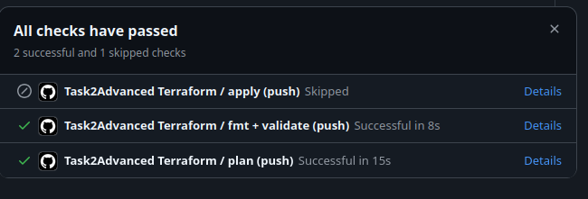

# Task2Advanced: Terraform + удалённый state + GitHub Actions

Инфраструктура описана Terraform-кодом (модуль ВМ на базе провайдера Yandex Cloud). Состояние основного стека хранится только в S3-совместимом backend (по умолчанию Yandex Object Storage); файлы `terraform.tfstate` не коммитятся.

`bootstrap/` — вспомогательный контур для учебного развёртывания бакета Object Storage и ключей доступа. Он нужен только для удобства локальной демонстрации полного цикла; по заданию обязательным результатом является основной стек в `terraform/` с S3 backend и CI/CD pipeline.

## Структура

| Путь | Назначение |
|------|------------|
| `terraform/` | Корень конфигурации: провайдер, модуль ВМ, `versions.tf` с `backend "s3" {}` |
| `terraform/backend.config.example.hcl` | Пример параметров backend для локального `terraform init -backend-config=...` |
| `terraform/backend.ci.template` | Шаблон backend для CI (плейсхолдеры `@BUCKET@`, `@KEY@`) |
| `terraform/terraform.tfvars.example` | Пример входных переменных без секретов |
| `modules/vm/` | Модуль вычислительной ВМ и дополнительного диска |
| `bootstrap/` | Вспомогательное однократное создание бакета под remote state для учебного проекта |
| `scripts/render-backend-ci.sh` | Сборка `terraform/backend.generated.hcl` из шаблона и переменных окружения |
| `scripts/bootstrap_apply.sh` | Apply bootstrap с тем же `YC_SERVICE_ACCOUNT_ID`, что и в задании 1 |
| `scripts/bootstrap_verify.sh` | Проверка bootstrap без облака или `terraform plan` с `--live` |
| `scripts/local_stack.sh` | Один проход: auth, `terraform_env.sh`, ключи из bootstrap, `backend.auto.hcl`, `init` + `plan` / `apply` |
| `scripts/cleanup_stack.sh` | Удаление: сначала основной стек (remote state), затем bootstrap (бакет с `force_destroy`, ключ) |
| `.github/workflows/terraform-task2-advanced.yml` (корень репозитория) | Пайплайн GitHub Actions |
| `img/pipeline_screenshot.png` | Скриншот успешных проверок workflow в GitHub |

## Bootstrap бакета под state

Каталог `bootstrap/` — отдельный корень Terraform **без** remote backend: state остаётся локально в `bootstrap/terraform.tfstate`. Так обходится цикл «нужен бакет, чтобы включить S3-backend». После bootstrap в основной конфигурации `terraform/` включается S3-backend с созданным бакетом.

Этот каталог не является обязательной частью решения по постановке: бакет и ключи можно создать вручную или использовать уже существующее S3-compatible хранилище. Поэтому к bootstrap применяются пониженные требования: он документирует учебный способ подготовки backend, а не заменяет требования к удалённому состоянию основного стека.

Создаются: бакет Object Storage и опционально статический ключ S3 для указанного сервисного аккаунта (`create_static_access_key`, по умолчанию включено). Отдельная IAM-привязка на бакет **не** создаётся: при типичной роли `storage.editor` на каталог она даёт `PermissionDenied`, а доступ к объектам в бакетах каталога у этой роли уже есть. Секрет ключа попадает в **локальный** state bootstrap — храните файл state вне Git и с ограниченным доступом. Версионирование бакета по умолчанию выключено (`TF_VAR_versioning=false`): при `true` часто нужны права шире, иначе **403** на `PutBucketVersioning`.

**Права сервисного аккаунта** (того, чей `YC_SERVICE_ACCOUNT_ID` вы передаёте): как минимум роль вроде `storage.editor` на каталог с бакетом (или шире), а для создания статического ключа — право на выпуск ключей для этого СА (например роль `iam.serviceAccounts.accessKeyAdmin` на ресурс этого СА). Точный набор ролей зависит от политики организации.

**Запуск создания** (как в задании 1: в окружении только идентификатор СА обязателен, токен получается через `yc iam create-token`):

```bash
export YC_SERVICE_ACCOUNT_ID=aje...
./Task2Advanced/scripts/bootstrap_apply.sh          # интерактивный apply
./Task2Advanced/scripts/bootstrap_apply.sh --yes    # без подтверждения
```

Опционально задайте `TF_VAR_bucket_name` (уникальное имя бакета целиком) или `TF_VAR_bucket_prefix` (если имя собирается автоматически). `cloud_id` / `folder_id` подставляются из `auth_cloud.sh` (`yc config`), при необходимости переопределите `TF_VAR_cloud_id` / `TF_VAR_folder_id`.

**Проверка:**

```bash
./Task2Advanced/scripts/bootstrap_verify.sh              # fmt + init + validate, облако не нужно
./Task2Advanced/scripts/bootstrap_verify.sh --live       # после auth: plan в каталоге bootstrap
```

## Backend (S3 / Object Storage)

В `terraform/versions.tf` объявлен пустой блок `backend "s3" {}`: bucket, key и параметры endpoint задаются при `terraform init` через файл или флаги `-backend-config`, без хранения секретов в Git.

Подходит любое S3 API–совместимое хранилище (Yandex Object Storage, MinIO, AWS S3). Для Yandex Object Storage используется endpoint `https://storage.yandexcloud.net` и флаги совместимости из примера `backend.config.example.hcl`.

Локально:

1. Поднимите бакет и ключи через **bootstrap** (раздел выше) либо создайте их вручную.
2. Скопируйте `backend.config.example.hcl` в `terraform/backend.auto.hcl` (файл в `.gitignore`), подставьте `bucket` и `key`.
3. Экспортируйте ключи для S3 backend в `AWS_ACCESS_KEY_ID` / `AWS_SECRET_ACCESS_KEY` или используйте **`./Task2Advanced/scripts/local_stack.sh plan`** (см. раздел «Скрипты») — скрипт подставит их из `bootstrap/terraform.tfstate` и сгенерирует `terraform/backend.auto.hcl`.
4. Выполните из каталога `terraform/`:

```bash
terraform init -backend-config=backend.auto.hcl
```

Если используете **`./Task2Advanced/scripts/local_stack.sh`**, шаги 2–4 выполняются внутри скрипта (после bootstrap достаточно `plan` или `apply`).

Переменные для провайдера Yandex (`YC_TOKEN` и значения `TF_VAR_*` / `terraform.tfvars`) настраиваются отдельно от backend.

## GitHub Actions

Файл: `.github/workflows/terraform-task2-advanced.yml`.

Пример итога проверок в PR или после `push` в `main`: `fmt + validate` и `plan` завершились успешно, job `apply` отмечен как пропущенный (типично для обычного push, без `workflow_dispatch` с последующим approval среды).



### Триггеры

- `pull_request` и `push` в `main` при изменениях внутри `Task2Advanced/terraform/**`, `Task2Advanced/modules/**`, `Task2Advanced/bootstrap/**`, `Task2Advanced/scripts/**` или самого workflow.
- `workflow_dispatch` — ручной запуск полного сценария (включая apply после approval).

### Задачи

1. **lint** — `terraform fmt -check -recursive` относительно каталога `Task2Advanced`, затем `terraform init -backend=false` и `terraform validate`. Проверка формата и схемы не требует доступа к backend и облаку.
2. **plan** — сборка `backend.generated.hcl` скриптом `scripts/render-backend-ci.sh`, `terraform init` с backend, `terraform plan -out=tfplan`, загрузка артефакта `tfplan`. Нужны секреты и переменные репозитория (см. ниже). Для pull request из форка задача пропускается, чтобы не расходовать секреты чужого репозитория.
3. **apply** — только при `workflow_dispatch` на ветке `main`, после успешного `plan`, с привязкой к среде GitHub `task2-terraform-apply`. Пока среда не одобрена назначенными ревьюерами, job не стартует. Затем повторная сборка backend-файла, `terraform init`, `terraform apply -auto-approve tfplan`.

`concurrency` с фиксированной группой отключает параллельные прогоны для одного репозитория, снижая риск гонок по одному и тому же state.

### Среда с ручным подтверждением

В настройках репозитория GitHub создайте environment с именем **`task2-terraform-apply`**, включите **Required reviewers** (как минимум одного). Пока ревьюер не нажмёт «Approve deployment», шаг `apply` не выполнится — это и есть ручное подтверждение после просмотра плана в логах job `plan`.

### Переменные и секреты репозитория

**Secrets**

| Имя | Назначение |
|-----|------------|
| `YC_TOKEN` | OAuth-токен или IAM-токен для провайдера Yandex Cloud |
| `YC_S3_ACCESS_KEY_ID` | Идентификатор статического ключа доступа к бакету state (попадает в `AWS_ACCESS_KEY_ID` для S3 backend) |
| `YC_S3_SECRET_ACCESS_KEY` | Секрет статического ключа (в `AWS_SECRET_ACCESS_KEY`) |
| `TF_SSH_PUBLIC_KEY` | Публичный SSH-ключ для `TF_VAR_ssh_public_key` |

**Variables** (Settings → Secrets and variables → Actions → Variables)

| Имя | Пример / смысл |
|-----|----------------|
| `TF_STATE_BUCKET` | Имя бакета с состоянием |
| `TF_STATE_KEY` | Путь к объекту state, например `task2/prod.tfstate` |
| `YC_CLOUD_ID` | Идентификатор облака |
| `YC_FOLDER_ID` | Идентификатор каталога |
| `YC_ZONE` | Зона, например `ru-central1-a` |
| `YC_SUBNET_ID` | Идентификатор подсети |
| `TF_VAR_VM_NAME` | Имя ВМ |
| `TF_VAR_CORES` | Число vCPU (строка, например `2`) |
| `TF_VAR_MEMORY` | RAM в ГБ (строка, например `4`) |
| `TF_VAR_ATTACH_DISK_SIZE` | Размер дополнительного диска в ГБ |

Метки `TF_VAR_labels` зашиты в workflow JSON-строкой; при необходимости вынесите их в variables и подставьте через `env`.

Имя **`TF_SSH_PUBLIC_KEY`** в секретах — это осознанное отличие от префикса `TF_VAR_`: значение всё равно передаётся в Terraform как `TF_VAR_ssh_public_key`.

### Безопасность и изоляция

- Статические ключи от бакета state не смешиваются с `YC_TOKEN`: разные секреты, разные роли в облаке.
- State не коммитится и не кладётся в артефакты: в артефакте только согласованный бинарный план `tfplan` (в нём теоретически могут быть чувствительные значения — ограничивайте доступ к Actions и срок хранения артефактов политикой организации).
- План для PR из форка не выполняется, чтобы не выдавать секреты внешним веткам.
- Apply только с `main` и только после approval среды.

## Скрипты

### `scripts/bootstrap_apply.sh`

Выполняет `source` корневого `scripts/auth_cloud.sh` (нужны `YC_SERVICE_ACCOUNT_ID` и настроенный `yc`). Выставляет `TF_VAR_cloud_id`, `TF_VAR_folder_id`, `TF_VAR_service_account_id`, `TF_VAR_zone`, затем в каталоге `bootstrap/` вызывает `terraform init` и `terraform apply`. Флаг `--yes` добавляет `-auto-approve`. После успеха выводит подсказки по `terraform output` для имени бакета и S3-ключей.

### `scripts/bootstrap_verify.sh`

Без `--live`: `terraform fmt -check -recursive` по всему `Task2Advanced`, затем изолированный `TF_DATA_DIR`, в `bootstrap/` — `init` и `validate` с фиктивными переменными (API Yandex не вызывается). С `--live`: тот же `auth_cloud.sh`, реальные `TF_VAR_*`, `terraform plan -detailed-exitcode` (код 2 трактуется как допустимый сценарий при отсутствии изменений или до первого apply). Опции `--skip-fmt`, `--no-terraformrc` — по смыслу как в `Task1Advanced/scripts/verify_taskadvanced1.sh`.

### `scripts/local_stack.sh`

Автоматизирует локальную работу с основным стеком `terraform/` и remote state:

1. `source` корневого `scripts/auth_cloud.sh` (`YC_SERVICE_ACCOUNT_ID`, `yc`).
2. `source` корневого `scripts/terraform_env.sh` — подстановка `TF_VAR_cloud_id`, `folder_id`, `zone`, `subnet_id`, `ssh_public_key` (как в задании 1).
3. Читает `terraform output -json` из **`bootstrap/`** (нужен успешный `bootstrap_apply`): `AWS_ACCESS_KEY_ID`, `AWS_SECRET_ACCESS_KEY`, имя бакета, при отсутствии `TF_STATE_KEY` — `recommended_state_key`.
4. Вызывает `render-backend-ci.sh` с `TF_BACKEND_OUT=.../terraform/backend.auto.hcl`.
5. `terraform init -backend-config=backend.auto.hcl` и **`plan`** или **`apply`**.

Пример (из корня репозитория):

```bash
export YC_SERVICE_ACCOUNT_ID=aje...
./Task2Advanced/scripts/local_stack.sh plan
./Task2Advanced/scripts/local_stack.sh apply --yes
```

Переопределения: любые уже экспортированные `TF_VAR_*` (в т.ч. из окружения до запуска), `TF_STATE_KEY`, `TF_VAR_vm_name` и т.д. Если не заданы, для ВМ используются значения по умолчанию (`future20-task2`, 2 vCPU, 4 ГБ RAM, диск 20 ГБ). S3-ключи для backend берутся из `terraform output` в `bootstrap/`; если там `null` (часто у **sensitive**), скрипт читает их из **`bootstrap/terraform.tfstate`**; при отсутствии и там — используйте **`AWS_ACCESS_KEY_ID`** / **`AWS_SECRET_ACCESS_KEY`** и при необходимости **`TF_STATE_BUCKET`**.

Требования: `terraform`, `yc`, `jq`.

### `scripts/cleanup_stack.sh`

По умолчанию: **1)** `terraform destroy` в `terraform/` (нужны `bootstrap/terraform.tfstate` и те же ключи S3, что при apply); **2)** в `bootstrap/` — краткий `terraform apply -target` только для бакета (чтобы в Object Storage применился `force_destroy` и не было ошибки **BucketNotEmpty**), затем `terraform destroy` (статический ключ и бакет).

Флаги: `--yes` — `-auto-approve` для обоих destroy. Переменные окружения: `CLEANUP_MAIN_ONLY=1` (не трогать bootstrap), `CLEANUP_BOOTSTRAP_ONLY=1` (только bootstrap; используйте, если основной стек уже уничтожен и объект state в бакете удалён вручную). S3-ключи: сначала output/state bootstrap, затем переменные **`AWS_*`** / **`TF_STATE_BUCKET`**; если ключей нет — **`yc iam access-key create`** для того же СА (временный ключ удаляется при выходе скрипта).

Если бакет создавался **до** появления `force_destroy` в репозитории, скрипт сам делает `apply -target` бакета перед `destroy`; при ручном `destroy` без скрипта сначала выполните `bootstrap_apply.sh --yes` или тот же targeted apply.

### `scripts/render-backend-ci.sh`

Назначение: собрать файл `terraform/backend.generated.hcl` для вызова:

```bash
terraform init -backend-config=backend.generated.hcl
```

Вход (обязательные переменные окружения):

| Переменная | Смысл |
|------------|--------|
| `TF_STATE_BUCKET` | Имя S3-бакета (подставляется вместо `@BUCKET@` в шаблоне) |
| `TF_STATE_KEY` | Ключ объекта state (вместо `@KEY@`) |
| `TF_BACKEND_OUT` | (Необязательно) путь к выходному `.hcl`; по умолчанию `terraform/backend.generated.hcl` |

Шаблон: `terraform/backend.ci.template`. По умолчанию результат — `terraform/backend.generated.hcl` (файл в `.gitignore`). Для локального файла `backend.auto.hcl` задайте `TF_BACKEND_OUT` (так делает `local_stack.sh`).

Пример локального запуска (из корня `Task2Advanced`):

```bash
export TF_STATE_BUCKET=my-tf-state-bucket
export TF_STATE_KEY=task2/dev.tfstate
bash scripts/render-backend-ci.sh
cd terraform && terraform init -backend-config=backend.generated.hcl
```

## Версии

- Terraform `>= 1.6.0` (в CI зафиксирован образ `1.8.5` в `hashicorp/setup-terraform`).
- Провайдер `yandex-cloud/yandex` версии из ограничений в `versions.tf`; актуальный отбор зафиксирован в `terraform/.terraform.lock.hcl` и `bootstrap/.terraform.lock.hcl`.

## Примечание по MinIO / AWS S3

Для MinIO или AWS замените блок `endpoints` и при необходимости добавьте `use_path_style = true` в свой backend-файл; шаблон `backend.ci.template` в репозитории заточен под Yandex Object Storage — при другом хранилище скорректируйте шаблон или собирайте `backend.generated.hcl` иным способом с теми же переменными `TF_STATE_*`.
