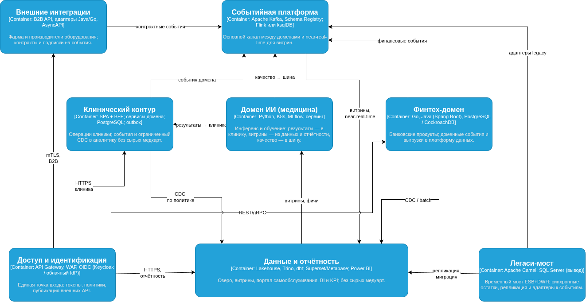
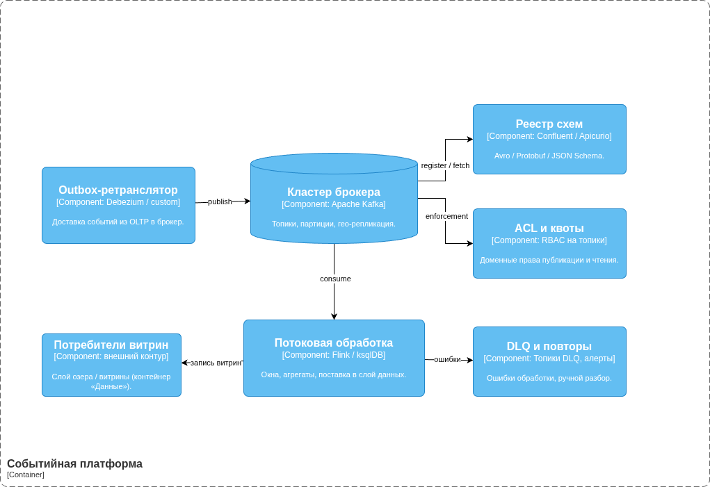
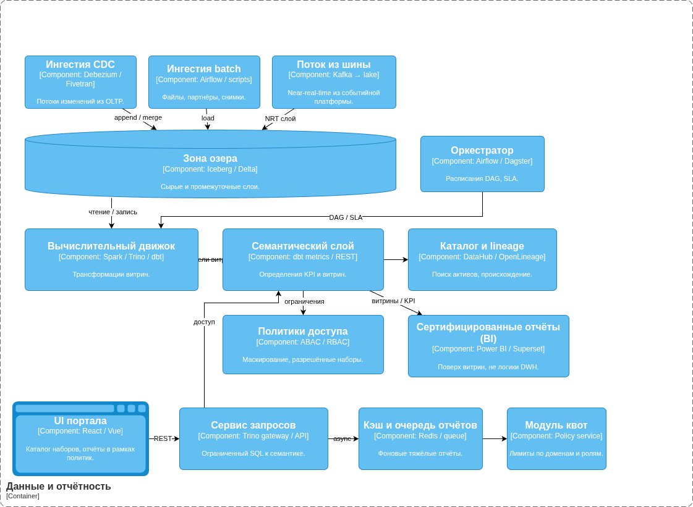
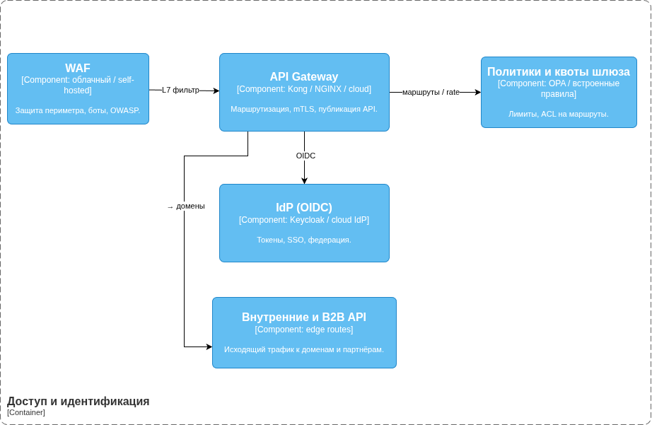
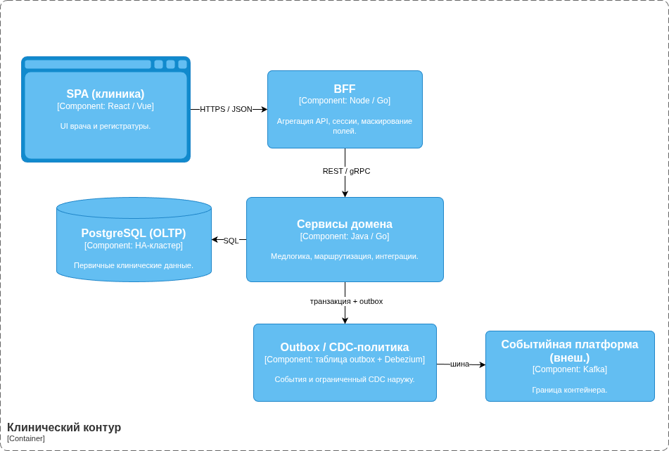
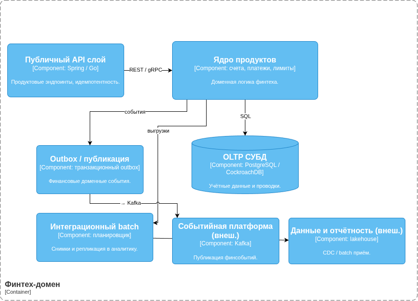
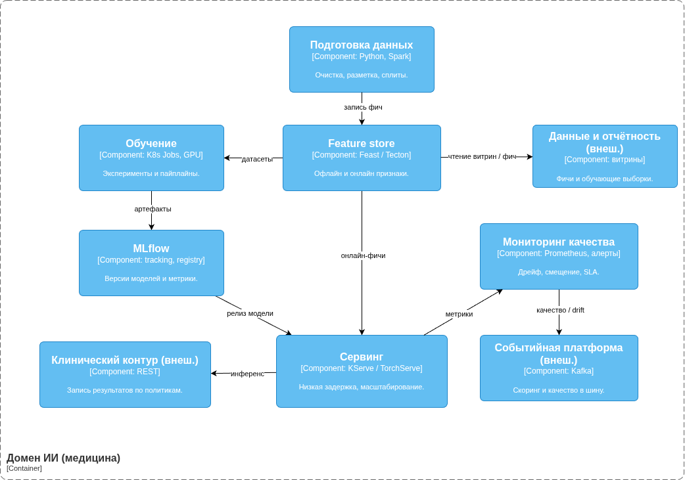
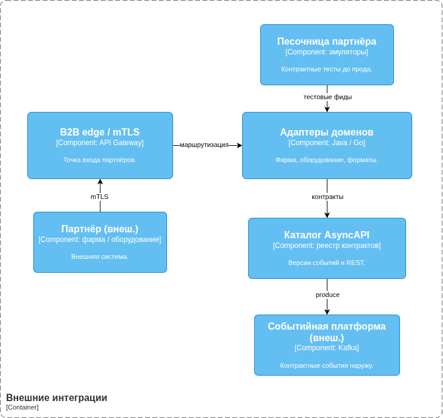
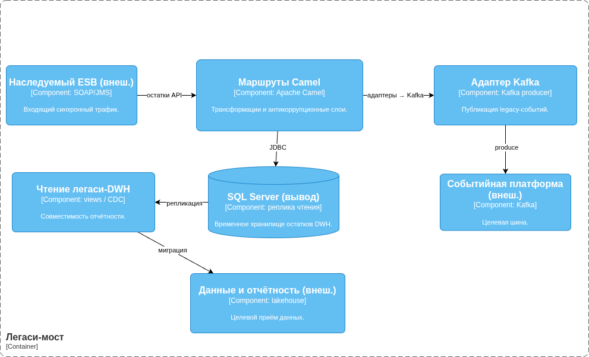

# Целевая архитектура и управление рисками трансформации

Материалы описывают целевое состояние экосистемы на горизонте трёх лет, карту рисков трансформации и план их снижения.

## Состав каталога

| Объект | Назначение |
|--------|------------|
| [C4.drawio](C4.drawio) | C4: уровень контейнеров (8 блоков, 15 связей) и уровень компонентов по отдельным вкладкам |
| [img/](img/) | Растровые копии диаграмм (ASCII-имена); те же снимки встроены ниже в этот файл |
| [transformation-risks.md](transformation-risks.md) | Карта рисков: категория, вероятность, влияние на бизнес |
| [risk-management-plan.md](risk-management-plan.md) | План управления рисками: меры, технические и управленческие рычаги |

Исполняемого кода в каталоге нет. Редактирование схем — в [diagrams.net](https://app.diagrams.net/) по файлу `C4.drawio`. Ниже встроены PNG; дубликаты лежат в `img/`. Текст по рискам — в перечисленных markdown-файлах.

## C4: целевая архитектура (сводка)

Горизонт — три года. Платформа опирается на слабосвязанную событийную модель, междоменный обмен через событийную шину, платформу данных с lakehouse и поэтапный вывод легаси (ESB/DWH) через временный **легаси-мост** с последующим отключением. Масштабирование: новые медицинские и финтех-направления, монетизация ИИ, новые регионы и источники данных, сдвиг к near-real-time.

Клинические первичные данные остаются в клиническом контуре; во внутреннюю аналитику и самообслуживание попадают только обезличенные агрегаты и наборы, разрешённые политиками. Наблюдаемость и аудит (трассировка, метрики, SIEM) сквозные и на диаграммах не размножаются отдельными стрелками.

### Уровень 2. Контейнеры

Восемь логических контейнеров: доступ и идентификация, клинический контур, финтех-домен, домен ИИ (медицина), событийная платформа, данные и отчётность, внешние интеграции, легаси-мост. Исходник: вкладка «Containers» в `C4.drawio`.

### Уровень 3. Компоненты

Детализация по вкладкам `C4.drawio`. PNG-копии каждого компонентного среза лежат в `img/`.

#### Событийная платформа

#### Данные и отчётность

#### Доступ и идентификация

#### Клинический контур

#### Финтех-домен

#### Домен ИИ (медицина)

#### Внешние интеграции

#### Легаси-мост

Файлы в `img/`: `c4-l2-containers.png`, `c4-l3-event-platform.png`, `c4-l3-data-reporting.png`, `c4-l3-access-identity.png`, `c4-l3-clinical.png`, `c4-l3-fintech.png`, `c4-l3-ai-medical.png`, `c4-l3-external-integrations.png`, `c4-l3-legacy-bridge.png`.

## Согласованность целевой модели

Целевая картина опирается на доменные границы, облачные среды по доменам, событийную шину как основной канал взаимодействия и поэтапный вывод легаси (DWH как центр логики, клиент на PowerBuilder, точечные синхронные интеграции) в режим мостов совместимости с последующим отключением.
