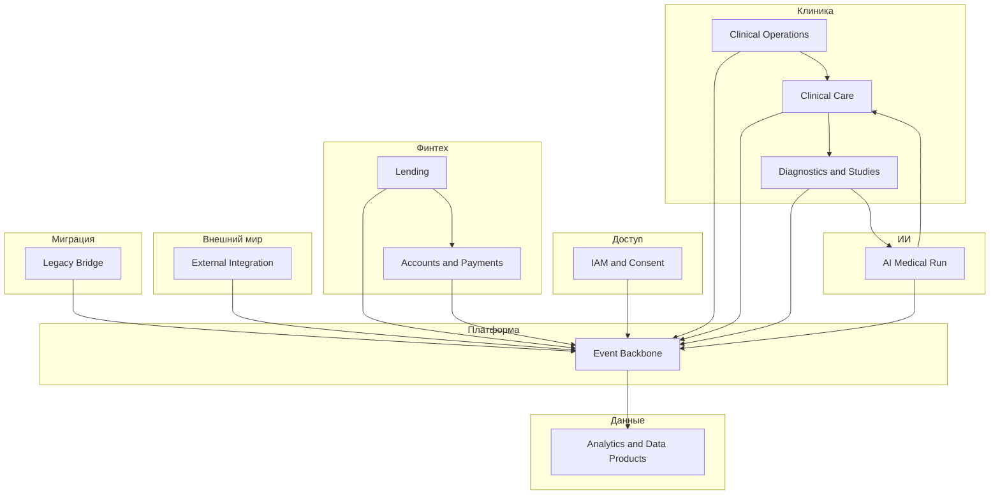

# Bounded contexts и контекстная карта

## Домены и bounded contexts

Домен — область бизнеса с единым языком и согласованными правилами. Bounded context — автономная модель внутри домена с явной границей консистентности и публичным контрактом наружу (события, API, политики данных).

| Домен | Bounded context | Назначение | Консистентность |
|-------|-----------------|------------|-----------------|
| Доступ и доверие | **IAM & Consent** | Учётные записи, роли, согласия на обработку данных, аудит доступа | Строгая внутри учётной записи и политики согласия |
| Клиника | **Clinical Care** | Ведение пациента, эпизоды лечения, клинические записи без детализации исследований | Транзакционная по эпизоду и записи |
| Клиника | **Diagnostics & Studies** | Назначения, статусы, результаты исследований (в т.ч. визуализация), связь с эпизодом | По заказу исследования и результату |
| ИИ-медицина | **AI Medical Run** | Запуск моделей, версии, входные снимки/сигналы, выход и объяснимость | По заданию на инференс |
| Финтех | **Accounts & Payments** | Счета, остатки, платежи, проводки | Строгая по счёту и платежу |
| Финтех | **Lending** | Кредитные продукты, договоры, графики, статусы обязательств | По договору |
| Операции | **Clinical Operations** | Расписание, смены, номенклатура и склад клиники (без клинического смысла диагнозов) | По смене, складской позиции |
| Данные и отчётность | **Analytics & Data Products** | Витрины, метрики, самообслуживание без PHI/истории болезни | Согласованность eventual по витрине |
| Партнёры | **External Integration** | Контракты с фармой, поставщиками оборудования, обмен справочниками и статусами поставок | По внешнему контракту |
| Платформа | **Event Backbone** | Топики, схемы, политики публикации, DLQ, идемпотентность на уровне платформы | Операционная, не бизнес-агрегаты |

**Легаси-мост** (DWH + ESB Camel) в целевой картине не является bounded context бизнеса, а **антикоррупционный и технический шлюз**: транслирует старые пакетные сущности в доменные события и обратно на время миграции.

## Таблица «узлы» контекстной карты (связи между BC)

| Upstream (поставщик знания) | Downstream (потребитель) | Паттерн | Комментарий |
|----------------------------|--------------------------|---------|-------------|
| IAM & Consent | Все продуктовые BC | Customer–Supplier | Единый источник идентичности и политик доступа |
| Clinical Care | Diagnostics & Studies | Customer–Supplier | Эпизод задаёт клинический смысл заказа |
| Diagnostics & Studies | AI Medical Run | Customer–Supplier | Заказ/результат — триггер и вход для ИИ |
| AI Medical Run | Clinical Care | Customer–Supplier | Заключение ИИ подтверждается клиническим контекстом |
| Clinical Care | Accounts & Payments | Separate Ways + события | Биллинг не тащит клиническую модель внутрь |
| Lending | Accounts & Payments | Customer–Supplier | Выдача связана со счётами и проводками |
| Clinical Operations | Clinical Care | Conformist / события | Расписание и ресурсы согласованы по событиям |
| Все BC | Event Backbone | Published Language | Общий каталог схем событий |
| Analytics & Data Products | Все BC | Conformist на read-моделях | Потребляет события и снимки, не изменяет первичку |
| External Integration | Clinical Operations, Lending | Anti-Corruption Layer | Внешние модели не протекают в ядро |

**Разделение регистрации и идентичности:** `Clinical Care` фиксирует факт появления пациента в клиническом контуре и публикует `PatientRegistered`. `IAM & Consent` остаётся владельцем цифровой учётной записи, ролей и согласий; он подписывается на событие регистрации, создаёт или связывает идентичность и далее публикует `AccessGranted` / `ConsentUpdated`.

## Таблица компонентов для диаграммы bounded contexts

| Название на диаграмме | Тип |
|-----------------------|-----|
| IAM & Consent | Bounded context |
| Clinical Care | Bounded context |
| Diagnostics & Studies | Bounded context |
| AI Medical Run | Bounded context |
| Accounts & Payments | Bounded context |
| Lending | Bounded context |
| Clinical Operations | Bounded context |
| Analytics & Data Products | Bounded context |
| External Integration | Bounded context |
| Event Backbone | Платформенный контур |
| Legacy Bridge (DWH/Camel) | Шлюз совместимости |

## Таблица стрелок (логические потоки, не физическая сеть)

| От | К | Подпись |
|----|---|---------|
| IAM & Consent | Event Backbone | Публикация `AccessGranted`, `ConsentUpdated` |
| Clinical Care | Event Backbone | `PatientRegistered`, `EncounterOpened`, `EncounterClosed` |
| Diagnostics & Studies | Event Backbone | `StudyOrdered`, `StudyCompleted`, `StudyCorrected` |
| AI Medical Run | Event Backbone | `AIMedicalRunCompleted`, `AIMedicalRunFailed` |
| Lending | Event Backbone | `CreditAgreementCreated`, `CreditAgreementActivated` |
| Accounts & Payments | Event Backbone | `PaymentPosted`, `AccountBalanceChanged` |
| Clinical Operations | Event Backbone | `ShiftAssigned`, `InventoryThresholdBreached` |
| External Integration | Event Backbone | `PartnerCatalogUpdated`, `EquipmentShipmentStatusChanged` |
| Event Backbone | Analytics & Data Products | Подписки на витрины |
| Legacy Bridge | Event Backbone | Нормализация пакетных выгрузок в события (миграция) |

## Пояснения (notes) для диаграммы

1. Граница **Clinical Care** не экспортирует в аналитику содержимое истории болезни и сырые исследования — только разрешённые бизнес-события и агрегаты для биллинга и операций.
2. **Event Backbone** — единая точка для версионирования схем, DLQ и политики повторов; бизнес-инварианты остаются внутри BC.
3. **Legacy Bridge** существует до выравнивания потоков; новые фичи не добавляют бизнес-логику в DWH.

## Mermaid: контекстная карта (упрощённо)

