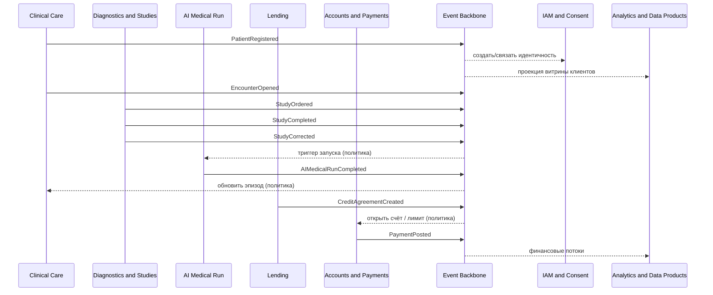
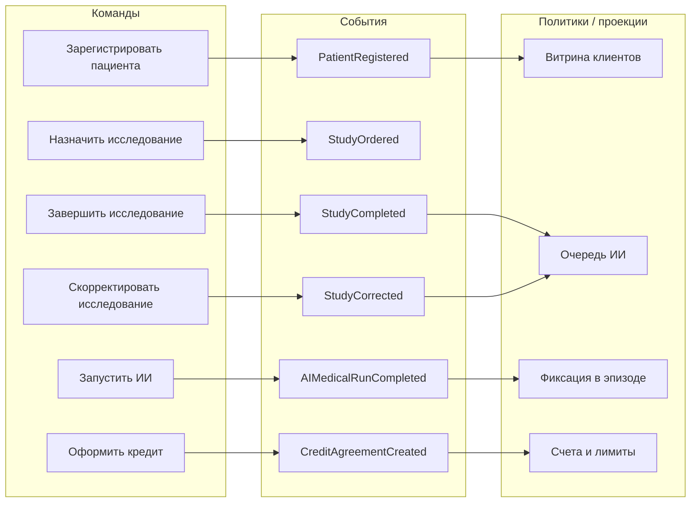

# Событийная схема (Event Storming)

Ниже — целевая картина: **оранжевые команды** инициируют изменения внутри bounded context, **розовые доменные события** публикуются в **Event Backbone**, **зелёные подписчики** строят реакции и проекции. Политики (бизнес-правила между контекстами) оформляются как обработчики событий с явными SLA и идемпотентностью.

## Легенда типов элементов

| Тип | Роль в схеме |
|-----|----------------|
| Команда | Намерение пользователя или системы изменить состояние одного агрегата |
| Доменное событие | Факт, произошедший в прошлом; неизменяемый сигнал для других BC |
| Политика / реакция | Правило «когда событие A, выполни команду B (возможно, в другом BC)» |
| Read-модель | Проекция для запросов и отчётности |

## Таблица: основные цепочки (команда → событие → подписчики)

| Команда (BC) | Доменное событие | Источник BC | Подписчики (BC) | Назначение связи |
|--------------|------------------|-------------|-----------------|------------------|
| Зарегистрировать пациента | `PatientRegistered` | Clinical Care | IAM & Consent, Analytics & Data Products, Lending (KYC-линк при необходимости) | Единый идентификатор стороны, витрины, финансовый онбординг |
| Открыть эпизод лечения | `EncounterOpened` | Clinical Care | Clinical Operations, Analytics & Data Products | Ресурсы и мощность, операционные дашборды |
| Назначить исследование | `StudyOrdered` | Diagnostics & Studies | AI Medical Run (опционально), Clinical Operations | Очередь аппаратов/лаборатории, триггер ИИ-пайплайна |
| Зафиксировать результат исследования | `StudyCompleted` | Diagnostics & Studies | Clinical Care, AI Medical Run | Обновление клинической картины, вход для моделей |
| Скорректировать результат исследования | `StudyCorrected` | Diagnostics & Studies | Clinical Care, AI Medical Run | Юридически значимое исправление результата и переоценка зависимых заключений |
| Запустить ИИ-анализ | (внутренняя операция) | AI Medical Run | — | — |
| Завершить ИИ-анализ | `AIMedicalRunCompleted` | AI Medical Run | Clinical Care, Analytics & Data Products (агрегаты) | Встраивание заключения в эпизод, мониторинг качества |
| Оформить кредитный договор | `CreditAgreementCreated` | Lending | Accounts & Payments, Analytics & Data Products | Счета, проводки, риск-витрины |
| Активировать договор | `CreditAgreementActivated` | Lending | Accounts & Payments | Списания, лимиты |
| Провести платёж | `PaymentPosted` | Accounts & Payments | Analytics & Data Products | Кассовые и финансовые витрины |
| Зафиксировать смену | `ShiftAssigned` | Clinical Operations | Analytics & Data Products | Загрузка персонала |
| Обновить каталог партнёра | `PartnerCatalogUpdated` | External Integration | Clinical Operations, Lending | Закупки, программы лояльности/рассрочки |

## Таблица стрелок для диаграммы Event Storming (событийный поток)

| От (источник события) | К (политика или проекция) | Подпись на стрелке |
|-----------------------|---------------------------|---------------------|
| Clinical Care | Event Backbone | `PatientRegistered`, `EncounterOpened`, `EncounterClosed` |
| Diagnostics & Studies | Event Backbone | `StudyOrdered`, `StudyCompleted`, `StudyCorrected` |
| AI Medical Run | Event Backbone | `AIMedicalRunCompleted`, `AIMedicalRunFailed` |
| Lending | Event Backbone | `CreditAgreementCreated`, `CreditAgreementActivated` |
| Accounts & Payments | Event Backbone | `PaymentPosted`, `AccountBalanceChanged` |
| Clinical Operations | Event Backbone | `ShiftAssigned`, `InventoryThresholdBreached` |
| External Integration | Event Backbone | `PartnerCatalogUpdated`, `EquipmentShipmentStatusChanged` |
| Event Backbone | Analytics & Data Products | Потоковые и пакетные витрины |
| Event Backbone | Clinical Care, Diagnostics & Studies, AI Medical Run, Analytics & Data Products, Lending | `ConsentUpdated`: остановка обработки, маскирование или отзыв доступа |

## Notes для диаграммы

1. Каждое событие несёт **идентификатор агрегата**, **версию**, **время возникновения** и **минимальный полезный груз** (см. `events.md`); расширения — через новые версии схемы.
2. Политики между доменами **не** используют синхронные цепочки через DWH; DWH участвует только через **Legacy Bridge** как источник/приёмник на время миграции.
3. Для клиники и ИИ действует разделение: в аналитику уходят **агрегированные** факты, не сырые медицинские тексты и изображения.

## Mermaid: swimlanes по доменам

## Mermaid: доска событий (упрощённый поток «слева направо»)

