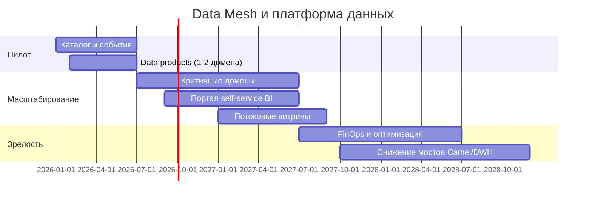

# Стратегический роадмап внедрения Data Mesh

Роадмап согласован с корпоративными этапами трансформации (0–6, 6–18, 18–36 месяцев) и бизнес-целями: продукты и монетизация, география, переход к near-real-time и слабосвязанной событийной платформе.

## Ключевые роли

| Роль | Ответственность в программе Mesh |
|------|----------------------------------|
| **Data Product Owner** | Приоритизация витрин и контрактов в домене, SLA потребителям, баланс регуляторных требований и self-service |
| **Data Engineer** | Пайплайны, качество данных, интеграция с потоковой платформой, антикоррупционные слои к легаси |
| **BI-аналитик** | Семантический слой для Power BI, типовые дашборды, обучение бизнес-пользователей, контроль исключений PHI из витрины |

Дополнительно на стороне платформы: владелец каталога и схем, SRE/Kubernetes, информационная безопасность (модель доступа по доменам).

## Привязка этапов к бизнес-целям

| Бизнес-цель | Как закрывает роадмап |
|-------------|------------------------|
| Новые финтех- и медицинские сервисы | Доменные data products и события снижают зависимость от центрального DWH |
| Выход в новые регионы | Повторяемые шаблоны контура домена, политики данных, изоляция чувствительных наборов |
| Near-real-time и рост источников | Потоковые витрины и каталог контрактов вместо только ночных загрузок в один узел |
| Монетизация ИИ | Отдельные data products для признаков и скорингов (в границах compliance), не смешивать с витриной самообслуживания для широкого круга |

## Этапы

### Фаза 1 — Пилот (0–6 месяцев)

- Выбор 1–2 доменов (например, финансовые расчёты и/или пациентский поток **без** PHI в витрине самообслуживания).
- Минимальный каталог схем, шина событий, DLQ, первый **data product** с контрактом и владельцем (Data Product Owner).
- Обучение трёх ролей в пилотных командах; BI-аналитик подключает Power BI к витрине пилота.

**Результат:** доказанная модель поставки данных из домена, измеримое сокращение очереди на изменения в центральном DWH для выбранных сценариев.

### Фаза 2 — Масштабирование (6–18 месяцев)

- Подключение критичных доменов (финтех, клинические операционные срезы вне PHI).
- Потоковые витрины для операционных KPI; антикоррупционные слои к Camel и остаточным потокам в DWH.
- Портал самообслуживания: публикация каталога data products, заявки на доступ, роли.

**Результат:** бизнес-пользователи в доменах работают с данными в новой архитектуре; легаси изолировано «мостами».

### Фаза 3 — Поддержка доменов и зрелость (18–36 месяцев)

- Регламенты жизненного цикла data product (версии контрактов, deprecation).
- Снижение доли синхронных интеграций на критическом пути; доменная аналитика на потоках.
- Оптимизация TCO облака, FinOps; вывод наиболее дорогих паттернов из SQL Server 2008.

**Результат:** событийная платформа как норма; DWH и Camel — только совместимость до полного вывода.

## Временная шкала (обзор)

## Риски и зависимости

- Без назначенных Data Product Owner в каждом подключённом домене программа скатывается в «ещё один слой витрин».
- Синхронизация ИБ и регуляторики с self-service должна опережать открытие широкого доступа к новым наборам.
- Зависимость от поставки облачной платформы и идентичности — критический путь для портала и межрегионального режима.
