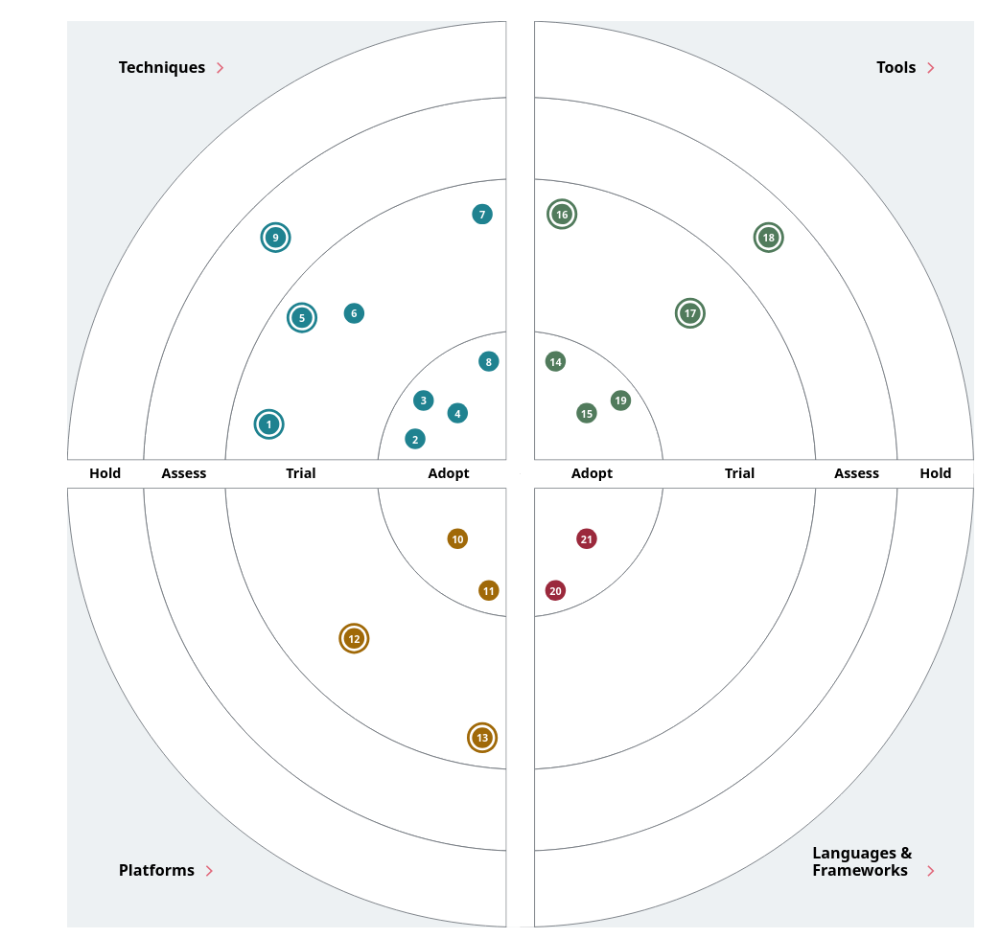

# Целевой технологический радар

Радар отражает целевой ландшафт после облачной миграции и внедрения доменной модели данных. Кольца: **Adopt** — стандарт для новых решений; **Trial** — пилоты и ограниченное производство; **Assess** — изучение и PoC; **Hold** — не расширять, выводить из активного развития.

## Архитектурные паттерны и практики

| Название | Тип | Кольцо | Комментарий |
|----------|-----|--------|---------------|
| Data Mesh | Паттерн организации данных | Trial | Пилот в 1–2 доменах, затем масштабирование по этапам из корпоративной программы |
| Event-Driven Architecture | Интеграционный стиль | Adopt | Целевое взаимодействие доменов; Camel/DWH — только мосты совместимости |
| Domain-Driven Design | Моделирование | Adopt | Границы контекстов и data products совпадают с доменами бизнеса |
| Self-service BI | Практика аналитики | Adopt | Портал витрин, выдача прав по доменам, ограничение PHI вне витрины |
| Data Contract / Schema Registry | Управление качеством | Trial | Единый каталог схем событий и контрактов API витрин |
| Batch + Near-real-time | Обработка | Trial | Пакет для отчётности регуляторов; потоки — для операционных срезов и монетизации |
| Anti-Corruption Layer | Интеграция | Trial | Слой между легаси (DWH, Camel) и целевыми сервисами доменов |
| Zero Trust / IAM по доменам | Безопасность | Adopt | Облачные политики доступа, сегментация PHI и финданных |

## Платформа и инфраструктура

| Название | Тип | Кольцо | Комментарий |
|----------|-----|--------|---------------|
| Управляемый Kubernetes (облако) | Платформа | Adopt | Рантайм для сервисов финтеха, интеграций, data plane |
| IaC (Terraform / аналог облака) | Инфраструктура | Adopt | Воспроизводимые среды по доменам |
| Объектное хранилище + ледяное хранилище | Хранение | Adopt | Сырые зоны, архив, большие объёмы исследований вне витрины самообслуживания |
| Распределённый SQL / колоночное DWH в облаке | Хранение | Trial | Целевой аналитический слой вместо монолитной логики в SQL Server 2008 |
| Потоковая платформа (Kafka-совместимая или облачный аналог) | Интеграция | Trial | Шина событий, DLQ, репликация между регионами |
| CI/CD (GitOps-подход) | Поставка | Adopt | Конвейеры для сервисов и data pipelines |

## Данные и каталог

| Название | Тип | Кольцо | Комментарий |
|----------|-----|--------|---------------|
| Data Catalog (линейка облака или OpenMetadata) | Метаданные | Trial | Поиск data products, происхождение данных, владельцы |
| dbt или облачный оркестратор SQL-трансформаций | Трансформации | Trial | Стандартизованные витрины внутри домена |
| Feature Store (для ИИ) | ML-платформа | Assess | Монетизация ИИ, воспроизводимость признаков |
| Lakehouse-паттерн | Архитектура хранения | Assess | Унификация batch/stream при росте объёмов |

## Прикладной стек (сохранение и развитие)

| Название | Тип | Кольцо | Комментарий |
|----------|-----|--------|---------------|
| Power BI | BI | Adopt | Основной инструмент визуализации; источники — data products, не прямой доступ к PHI |
| Python (ИИ-сервисы) | Язык | Adopt | Текущий стек ML/ИИ |
| Go / Java (финтех) | Язык | Adopt | Текущий стек транзакционных сервисов |
| Apache Camel | ESB | Hold | Только мосты; новые интеграции — на событиях и API |

## Легаси и вывод

| Название | Тип | Кольцо | Комментарий |
|----------|-----|--------|---------------|
| Microsoft SQL Server 2008 (DWH) | СУБД | Hold | Миграция бизнес-логики наружу; сокращение нагрузки отчётности |
| PowerBuilder (операторский UI) | Клиент | Hold | Замена веб-клиентами доменов по мере готовности |

## Сводка по кольцам

| Кольцо | Доля позиций (ориентир) | Назначение |
|--------|-------------------------|------------|
| Adopt | ~40% | Облако, EDA, DDD, self-service BI, Kubernetes, IaC, основные языки |
| Trial | ~35% | Data Mesh, контракты, потоки, каталог, dbt |
| Assess | ~15% | Feature Store, Lakehouse-паттерн |
| Hold | ~10% | SQL Server 2008 как DWH-ядро, PowerBuilder, расширение Camel |

## Визуализация радара

Целевая визуализация — интерактивный радар на базе open-source **ThoughtWorks Build Your Own Radar**: каталог [byor-radar/](byor-radar/), исходные данные — [byor-radar/files/future20-tech-radar.csv](byor-radar/files/future20-tech-radar.csv), запуск через `docker compose` и точная ссылка для открытия описаны в [byor-radar/README.md](byor-radar/README.md). Квадранты: `techniques`, `platforms`, `tools`, `languages & frameworks`; кольца: `adopt`, `trial`, `assess`, `hold`. Файлы `radar.csv` и `radar.json` в контейнере перезаписываются демо-данными Thoughtworks при каждом старте, поэтому используется отдельное имя CSV.

Статический снимок интерактивного радара (для просмотра без Docker):

